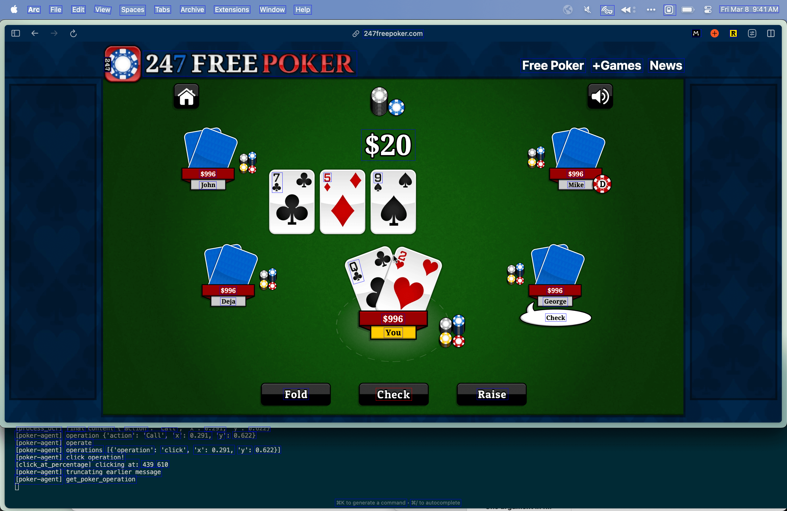

## GTO Poker Bot

<!-- 
Acknowledges that this is a project in CSC 481 - Knowledge Based Systems at Cal Poly and includes the instructor's name
Gives credit to any external resources the project is based on (libraries, competition frameworks, etc.)
Has clear instructions for how to install any dependencies and how to run the main use cases with various parameters.
For example, if you implemented various agents that play tic-tac-toe on a board of any size versus either a human or another agent , your readme should inform the reader how to play as a human versus any of the agents, on a board of any size.
Either has instructions for how to reproduce the main results in your report, or has links to any tables, graphics and summarizations of the result.
For example, if you validated a heuristic agent and a tree search agent by having them play 10k matches against each other, your readme should also inform the reader how to run that evaluation scenario. If you collected data about a high number of agents, it should also include a table that summarizes the result of each match-up.

-->

### Acknowledgements

This project is part of CSC 481 - Knowledge Based Systems at Cal Poly with Professor Rodrigo Canaan.

The autonomous part of our project is based of the work of self-operating coomputer by HyperwriteAI https://github.com/OthersideAI/self-operating-computer.

### Getting started (replicating results):
------
Clone the repository
```
git clone https://github.com/arnenoori/gto-poker-bot
```

Create venv
```
python3 -m venv env
```
Activate it (Mac)
```
source env/bin/activate
```
Install requirements
```
pip install -r requirements.txt
```
Add OpenAI Key
```
export OPENAI_API_KEY=yourkeyhere
```

Go on your poker website of choice. We used www.247freepoker.com and played against bots.

To run the agent with the fixed strategy agent (default), simply run:
```
python play.py
```

or you can also run with
```
python play.py --fixed
```

To run the agent with the DQN agent first train the agent by running (or you can use the pretrained model trained_model.h5):
```
python dqn_agent.py
```
Then run:
```
python play.py --dqn
```

Or if you want to run the random agent:
```
python play.py --random
```

### 3 different agents
---

-  ``agent_random.py``: an agent making random decisions (used for testing and comparison)
-  ``agent_dqn.py``: a deep q agent
-  ``fixed.py``: a fixed model

You can test the performance of the 3 different agents playing each other by running:
```
python evaluate.py
```

### Repository Structure
---

* [gamer/](./gamer)
  * [adapter.py](./gamer/adapter.py)
  * [api.py](./gamer/api.py)
  * [config.py](./gamer/config.py)
  * [fixed.py](./gamer/fixed.py)
  * [operating_system.py](./gamer/operating_system.py)
  * [prompts.py](./gamer/prompts.py)
  * [tools.py](./gamer/tools.py)
  * [utils.py](./gamer/utils.py)
* [media/](./media)
  * [cowboy_bebop_poker.gif](./media/cowboy_bebop_poker.gif)
* [report/](./report)
  * [proposal/](./report/proposal)
    * [CSC481_Project_Proposal.pdf](./report/proposal/CSC481_Project_Proposal.pdf)
    * [projectproposal.md](./report/proposal/projectproposal.md)
  * [481_report.md](./report/481_report.md)
  * [487_report.md](./report/487_report.md)
  * [final_presentation.pdf](./report/final_presentation.pdf)
* [.env](./.env)
* [.gitignore](./.gitignore)
* [README.md](./README.md)
* [dqn_agent.py](./dqn_agent.py)
* [evaluate.py](./evaluate.py)
* [play.py](./play.py)
* [random_agent.py](./random_agent.py)
* [requirements.txt](./requirements.txt)

### How it works:

GPT-V is used to extract the game state from the screenshots. The extracted information is then used to make decisions based on the current state of the game. Here is an example of the screenshot sent to GPT-V:



Read more in our technical report.

### Results


**Results after 1000 hands:**

DQN Agent Wins: 51

Fixed Model Wins: 927

Random Model Wins: 6

Ties: 16