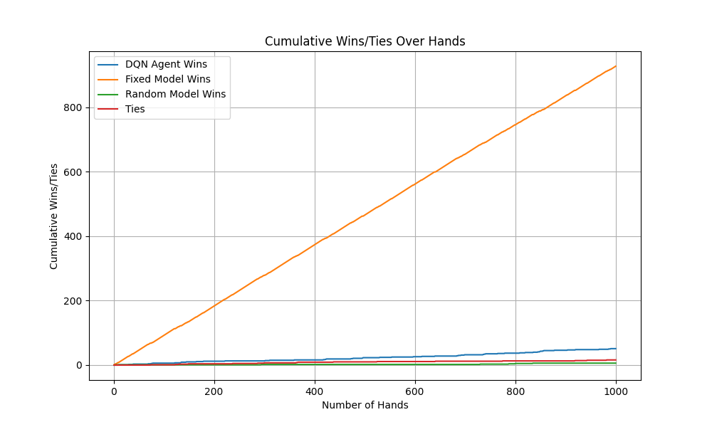

<!--
[Note: This is a template for the assignments in the CPE/CSC 481class. Create a copy of this document or copy and paste the content. Replace or delete the text in square brackets.]

pandoc 481_report.md -o GTOPokerFinalProjectReport481.pdf --pdf-engine=xelatex
-->

##  1. Introduction
<!--
[This section should contain all of the following.
A brief description of the problem you are trying to solve (e.g. using AI to detect cats and dogs).
Your motivation for why you chose to address it (you can highlight connections to class topics you wanted to delve deeper on, and/or highlight the challenges involved, especially if it is an unsolved problem)
An outline of your implementation, including important resources (e.g. “we used pytorch to train a neural network on 100k pictures of cats and dogs from an online dataset”)
A summary of results (e.g. “our final trained model had an accuracy of 80% on held-out samples”).
 ]
-->

Our GTO Poker Bot tackles the challenge of finding an optimal poker strategy using a knowledge-based approach inspired by game theory optimal (GTO) principles. The bot simulates human-like gameplay by interpreting the game state visually from the poker client and clicking buttons in the browser to play. It includes two different agent types: a fixed strategy agent based on GTO principles and a Deep Q-Network (DQN) agent that attempts to learn through self-play.  

We chose this project to explore how AI techniques can be applied to the complex domain of poker, which, unlike games like chess and Go, remains an unsolved challenge for AI. Poker involves elements of imperfect information, stochastic events, and intricate game-theoretic considerations, making it a promising and engaging domain for AI research.

The bot is implemented in Python and designed to be compatible with various online poker platforms. It leverages the GPT-V model to interpret the game state from visual screenshots. The codebase has a modular architecture, with the logic for the fixed strategy agent located in `fixed.py` and the DQN agent in `dqn_agent.py`. Key parameters of the poker environment include a 52-card deck, predetermined starting stack sizes for each player, and defined small/big blind amounts.

We ran a series of 1000 simulated poker hands pitting the fixed strategy agent, DQN agent, and a random agent against each other. The fixed strategy agent emerged as the decisive winner, prevailing in 927 hands. The DQN agent managed to win 51 hands, while the random agent won only 6. There were 16 hands that resulted in ties. These results demonstrate the superiority of the fixed strategy agent, which leverages game theory optimal principles, over the learning-based DQN approach and random play. However, the relatively poor performance of the DQN agent points to the limitations and challenges of learning effective strategies in this highly complex problem domain.

## 2. Problem Specification

<!-- 
[Describe the problem you are trying to address. What is the goal, what are the main challenges, what (if any) progress has been made so far in addressing the problem by other people, what tools are available for your team to use as a starting point. You can also perform a simplified PEAS specification- Performance, Environment,  Actuators, Sensors, but this is not required.

If you’re working with a game, a short description of its rules is also desirable. Do not assume your reader is familiar with your domain.

It is also advisable that you state parameters that relate to the problem specification, such as size of the board, number of levels, number of training samples, size of the dictionary used etc. Parameters that are very implementation-specific (such as learning rates, search depth, mutation/crossover rates) are better stated in section 5, although some overlap is also acceptable.]
-->

The GTO Poker Bot project addresses the challenge of creating an AI agent that can play poker optimally by visually interpreting the game state and taking actions through a web browser, simulating human play. Poker presents unique difficulties for AI due to its elements of imperfect information, stochastic events, and the need for complex strategic reasoning.

Poker involves hidden information (opponents' private cards), which makes it challenging to determine the optimal strategy. The game also includes random events in the form of card dealing, requiring the AI to reason under uncertainty. Furthermore, poker demands sophisticated strategic thinking, including the ability to bluff, model opponents, and adapt to changing game dynamics.

The main challenges in developing a poker AI include:

1. **Handling imperfect information**: The AI must make decisions based on incomplete knowledge of the game state, considering the range of possible opponent holdings and strategies.
2. **Dealing with stochastic events**: The random dealing of cards introduces uncertainty, requiring the AI to reason probabilistically and adapt its strategy accordingly.
3. **Modeling opponents**: To make optimal decisions, the AI must be capable of inferring opponents' likely holdings and strategies based on their actions.
4. **Developing a robust and adaptive strategy**: The AI needs to employ a strategy that is effective against a wide range of opponent playing styles and able to adjust as the game progresses.
5. **Interacting with the environment**: The AI must be able to interpret the game state visually and execute actions through a web browser interface, simulating human interaction with the poker platform.

While significant progress has been made in poker AI, with notable achievements like Libratus, Pluribus, and DeepStack (more on this within the next section), existing approaches often rely on computationally intensive algorithms and require direct access to the game state, making them unsuitable for deployment in real-world online poker environments.

Our GTO Poker Bot project aims to tackle these challenges by developing an AI agent that can learn and execute optimal strategies in a human-like manner, interacting with the poker platform through visual interpretation and simulated actions through clicking buttons in the browser. Our project explores the potential of combining knowledge-based approaches, such as a fixed strategy based on game-theoretic principles, with reinforcement learning techniques to create an effective and adaptable poker AI.

### Tools and Starting Points

The project leverages TensorFlow for implementing the DQN agent and GPT-V for interpreting the game state from screenshots. The fixed strategy agent [fixed.py] and the DQN agent [dqn_agent.py] serve as the core components, with the operational framework [play.py] enabling interaction with online poker games. We used the framework self-operating computer [1] by HyperwriteAI as the basis for creating the autnomous mouse-clicking part of our project. We initially tried existing libraries such as NeuronPoker, PokerPy, and PokerStove but they were all outdated and not maintained, so we fould it faster to create our own.

### PEAS

- **Performance:** Success is measured by the agent's ability to win hands and maximize earnings over time.
- **Environment:** Online poker platforms, characterized by varying game states, opponent strategies, and the visual presentation of information.
- **Actuators:** Actions within the game, such as fold, call, and raise, executed through simulated mouse clicks and keyboard inputs.
- **Sensors:** Screenshots of the game, processed and interpreted to understand the current state of the board and make decisions.

### Game Rules and Parameters

Poker, specifically the no-limit Texas Hold'em variant, involves players making the best 5-card hand from two private hole cards and five community cards. The game consists of four main betting rounds:

1. **Preflop**:  After players receive their two hole cards, betting action starts with the player to the left of the big blind and continues clockwise. Players can call the big blind amount, raise, or fold.
2. **Flop**: After the first three community cards are dealt, another round of betting takes place, starting with the player to the left of the button. Players can check if no bet has been made, or bet if they wish to.
3. **Turn**: The fourth community card is dealt, followed by a betting round.
4. **River**: The final community card is dealt, with a final round of betting. If more than one player remains after this, a showdown occurs where the player with the best 5-card hand wins the pot.

In no-limit Texas Hold'em, players can bet any amount up to all of their chips at any time, allowing for more aggressive play and bigger pots compared to limit hold'em.[13] The minimum bet size is usually the amount of the big blind, and the minimum raise must be at least the size of the previous bet or raise.[13]

A dealer button rotates clockwise after each hand to determine the positions of the small blind, big blind, and order of betting. The small blind and big blind are forced bets made before any cards are dealt, with the small blind typically being half the amount of the big blind.[13]

Standard poker hand rankings are used, from best to worst: royal flush, straight flush, four of a kind, full house, flush, straight, three of a kind, two pair, one pair, and high card. If two players have the same ranked hand, the rank of the next card(s) in their hand determines the winner. Suits are not used to break ties.

While the basic flow of the game is straightforward with its rounds of dealing and betting, the nuanced strategies emerge from the no-limit betting structure, positioning, and inferring opponents' likely hands. To be successful, players must constantly adjust their strategies based on factors such as their position, the strength of their hand, the size of the pot, and their opponents' perceived range of hands and tendencies. Mastering the game requires a deep understanding of probability, psychology, and game theory in addition to the fundamental rules.

### Implementation-Specific Parameters

- **Number of Cards:** 52-card deck.
- **Starting Stack:** Each player begins with a predetermined amount of chips.
- **Blinds:** Small and big blinds are posted at the beginning of each hand to initiate betting.

## 3. Related Work
<!--
[This section fulfills two main objectives: 
Identify important work that is related to your project: what approaches have people used to address it? What’s the current state of the art (if applicable)? 
Identify resources you used directly in your project. Between this section and the Implementation section, you should paint a clear picture of what was already implemented, and what you did yourself. This might mean you used the code mostly as-is, but performed some analysis of your own,, that you used some building blocks to implement an algorithm yourself, that you explored parameter variations of existing algorithms, that adapted existing code to work in a different environment or dataset, etc 
	Note that, for this assignment, I will be requiring all references to be numbered and referenced in text. For example “Imagenet [1] is a database with more than 14 million images that is commonly used for computer vision research”]
-->

In recent years, several noteworthy poker AI systems have been developed, each taking different approaches to tackle the game's complexities. 

### Libratus (2017)

Libratus, created at Carnegie Mellon University in 2017, employs counterfactual regret minimization (CFR) to compute a blueprint strategy through self-play and refines it in real-time using nested safe subgame solving.[3][6] Libratus did not use neural networks, instead relying mainly on reinforcement learning through CFR. It learned poker from scratch by playing trillions of hands against itself over several months.[1] This approach allowed Libratus to become the first AI to defeat top human professionals in heads-up no-limit Texas Hold'em poker.[3]

### Pluribus (2019)

Building upon Libratus' success, Pluribus, developed by researchers from Facebook AI and Carnegie Mellon in 2019, became the first AI to beat elite human professionals at six-player no-limit Texas Hold'em.[4][6] Pluribus extends CFR to handle multiplayer settings using Monte Carlo CFR for improved scalability and a depth-limited search for a finer-grained abstraction of the game tree.[4][6] Like Libratus, Pluribus also did not use neural networks and learned poker solely through self-play, with no human data or expert knowledge.[4][6] Notably, Pluribus employs innovative mixed strategies and donk betting that differ from typical human play.[4][7]

### DeepStack (2017)

DeepStack, created by researchers from the University of Alberta, Czech Technical University, and Charles University in 2017, takes a different approach by leveraging deep learning and decomposition to reason about game situations.[5][6][8] Unlike Libratus and Pluribus, DeepStack relied heavily on deep neural networks to make decisions. The networks were trained on a massive amount of random poker situations.[4] It uses heuristic search aided by deep neural networks for intuition, continual re-solving to update strategies based on the current situation, and depth-limited search with neural networks to estimate values.[5][6]

### Our Approach

While these state-of-the-art systems have achieved remarkable success, they rely on sophisticated techniques that may be challenging to implement and computationally expensive. In contrast, our GTO Poker Bot explores the potential of a more accessible knowledge-based approach, particularly through the use of a fixed strategy agent that embodies the principles of game theory optimal (GTO) play. This agent serves as a strong baseline for evaluating the performance of the learning-based DQN agent.

The fixed strategy agent draws inspiration from the concept of Nash equilibrium, a central concept in game theory. In a two-player zero-sum game like heads-up poker, a Nash equilibrium is a pair of strategies where neither player can improve their expected outcome by unilaterally changing their strategy.[8] The fixed strategy agent aims to approximate a Nash equilibrium strategy by making decisions based on hand strength, pot odds, and opponent actions.

To implement the fixed strategy agent, we build upon existing knowledge in the field of poker game theory. Resources such as GTO Wizard[10] and GTOBase[11] provide valuable insights into game theory optimal strategies for various poker situations. By incorporating this knowledge into the fixed strategy agent, the GTO Poker Bot explores the effectiveness of a knowledge-based approach in achieving strong poker performance.

The inclusion of the fixed strategy agent not only provides a robust benchmark for evaluating the DQN agent's performance but also allows for a comparative analysis of knowledge-based and learning-based approaches in the context of poker AI. By examining the strengths and limitations of each approach, we aim to contribute to the ongoing discourse on the most effective methods for tackling imperfect information games like poker.

## 4. Implementation
<!--
4.a) Methods and justification
[Describe which methods you considered applying to the problem, which you decided to implement for this assignment and a justification of this choice. This subsection may be omitted if you prefer to discuss the merits of each alternative and your ultimate justification in the Related Work section]
4.b) Implementation 
[This subsection should provide the following:
- any resources you used as a starting point for your implementation. Between this section and information under Related Work, you should paint a clear picture of what was already implemented, and what you did yourself.
- Knowledge representation: What type of knowledge will your system handle? How will it be obtained (Will you build a KB from scratch? Will you scrape data off the internet (which source)? Will you encode the rules of a game as a knowledge base? Do you need to research expert knowledge?) How will it be represented (a Prolog KB, a relational database, JSON files, custom classes and objects in an OO language…)? How big is the dataset?
- A description of the system itself: identify the main modules, parameters, training procedures, the algorithms involved and the way the user interacts with the systems, relevant data structures. Don’t assume deep familiarity with your methods. 
- A description of the processes (code) used to evaluate the system (for example, after implementing MCTS, you played 100 matches against a random agent, or after implementing your cat/dog recognition system you built a demo that identifies cats/dogs on a live video)
-- If your agent needs to be trained, specify how training data was collected, how big the dataset was, what loss functions were used.
- If applicable, provide references to where the reader might find more details about your methods]
-->

The GTO Poker Bot is implemented using a modular architecture, with the main components being the Fixed Strategy Agent (`fixed.py`), the DQN Agent (`dqn_agent.py`), and the Operational Framework (`play.py`).

### Fixed Strategy Agent

The Fixed Strategy Agent embodies the knowledge-based approach in the GTO Poker Bot. It makes decisions based on a predefined set of rules derived from game-theoretic optimal (GTO) principles. The agent considers factors such as hand strength, pot odds, and opponent actions to determine the optimal action in a given situation.

The implementation of the Fixed Strategy Agent involves:

1. **Hand Strength Evaluation**: The agent assesses the strength of its hand using a heuristic scoring system that assigns higher values to stronger hands (e.g., royal flush, straight flush, four of a kind) and lower values to weaker hands (e.g., high card, one pair). The evaluation takes into account both the private cards and the community cards.

2. **Pot Odds Calculation**: The agent computes the pot odds, which represent the ratio of the current size of the pot to the cost of a contemplated call. This information is used to determine whether it is profitable to continue in the hand or fold.

3. **Opponent Action Consideration**: The agent takes into account the actions of the opponents, such as their betting patterns and the frequency of their raises. This information is used to adjust the agent's strategy and make more informed decisions.

4. **Decision Making**: Based on the hand strength, pot odds, and opponent actions, the agent selects the optimal action from a predefined set of options (e.g., fold, call, raise). The decision-making process is guided by a set of rules that aim to maximize the expected value (EV) of the agent's actions.

The Fixed Strategy Agent's implementation is contained in the `fixed.py` file, which includes functions for hand evaluation, pot odds calculation, and decision making based on predefined rules.

### DQN Agent

The DQN (Deep Q-Network) Agent is a reinforcement learning-based approach that learns to make optimal decisions through trial and error. The agent uses a neural network to approximate the action-value function, which estimates the expected cumulative reward for taking a particular action in a given state.

The implementation of the DQN Agent involves:

1. **State Representation**: The game state is represented as a vector that includes information about the agent's private cards, the community cards, the pot size, and the actions taken by the opponents. This state representation serves as the input to the neural network.

2. **Action Space**: The agent's action space consists of three possible actions: fold, call, and raise. These actions are represented as discrete values (e.g., 0, 1, 2) and are the outputs of the neural network.

3. **Reward Function**: The reward function determines the immediate reward the agent receives for taking a particular action. In the context of poker, rewards can be based on the amount of money won or lost in a hand.

4. **Experience Replay**: To stabilize the learning process, the agent uses an experience replay buffer that stores past state-action-reward-next_state tuples. During training, the agent samples mini-batches from this buffer to update the neural network parameters.

5. **Training Process**: The DQN Agent is trained through self-play, where it plays against itself or other agents to generate training data. At each step, the agent selects an action based on the current state, observes the reward and the next state, and stores this experience in the replay buffer. Periodically, the agent samples a mini-batch from the buffer and updates the neural network parameters using the Q-learning algorithm.

The DQN Agent's implementation is contained in the `dqn_agent.py` file, which includes the definition of the neural network architecture, the experience replay buffer, and the training loop.

### Operational Framework

The Operational Framework (`play.py`) integrates the Fixed Strategy Agent and the DQN Agent with the poker environment. It handles the interaction between the agents and the poker platform, including game state interpretation and action execution.

The main components of the Operational Framework are:

1. **Game State Interpretation**: The framework uses the GPT-V model to interpret the game state from screenshots of the poker platform. It processes the visual information to extract relevant features such as the community cards, the agent's private cards, the pot size, and the opponents' actions.

2. **Action Execution**: Based on the decisions made by the agents, the framework simulates the appropriate actions (fold, call, raise) by sending commands to the poker platform through web browser automation techniques (e.g., Selenium, Puppeteer).

3. **Agent Integration**: The framework allows for seamless integration of different agent implementations, such as the Fixed Strategy Agent and the DQN Agent. It provides a unified interface for the agents to receive game state information and return their chosen actions.

The Operational Framework's implementation is contained in the `play.py` file, which includes functions for game state interpretation, action execution, and agent integration.

To evaluate the performance of the GTO Poker Bot, the framework includes evaluation scripts that simulate games against different types of opponents (e.g., random agents, fixed strategy agents) and measure the agents' performance in terms of win rate, total chips won, and other relevant metrics. These evaluation scripts are contained in files such as `evaluate.py` and `simulate.py`.

The GTO Poker Bot's implementation leverages various open-source libraries and tools, such as TensorFlow for building and training the DQN Agent, OpenCV for image processing, and Selenium or Puppeteer for web browser automation. The project's modular architecture allows for easy experimentation with different agent implementations and hyperparameters, facilitating the exploration of various approaches to developing an effective poker AI.

## 5. Analysis
<!--
5a) Evaluation criteria
[Describe your goal for the performance of your system. Note that these evaluation criteria are ways in which you, as a group, can evaluate whether the system performed well (e.g. “we wanted to make a bot with at least 80% win rate against a bot that selects actions at random). Do not confuse it with the heuristics or evaluation functions the agent uses to evaluate a certain state or position. If you want to talk about heuristics, feel free to create a dedicated subsection for that]

5-b) results[Analysis of expectation versus outcomes in using the tool (what worked? what didn't? Did it run in reasonable time?); Identification of surprising elements or usability hints (things that might not be apparent to a new user); Analysis of numerical results (if applicable).
Most groups are interested in comparing a few variations of the system using a few different metrics. For this reason, it is highly recommended that you sumarize your results in tables or graphics.
I will require all tables and graphics to be numbered and referenced in text. Each table/graphic should have a centralized title and short description or caption (e.g. "Table 1: average win rate of each pair of bots after 10 matches ") as well as a reference in text (e.g. Table 1 shows that the best bot is MCTS, with a positive win rate against all other bots). Note that this type of reference also helps eliminate ambiguities (in this example, I could look at the table and not know whether an entry of 60% involving bots A and B means that bot A won 60% of the time or vice versa. By telling me the best bot in text, I now know which value refers to what. You can also make this explicit by putting something like "Entries reflect the win-rate of the bot in the horizontal row when playing against the bot in the vertical column".
]
-->

Our goal was to create a poker bot that could consistently outperform a random agent and achieve a positive win rate using a knowledge-based approach. Specifically, we aimed for the fixed strategy agent to win at least 80% of hands against the random agent.

To evaluate the system, we conducted the following analyses:

1. Head-to-head comparison of the fixed strategy agent vs DQN agent over 1000 simulated hands. Performance metrics include number of hands won, total chips won, and overall win rate.
2. Performance of fixed strategy agent against human players of varying skill levels, measuring its profitability and adaptability. 
3. Comparison of the fixed strategy agent's decisions to game theory optimal strategies from GTO Wizard [10] and GTOBase [11] to assess how closely it approximates optimal play.
4. Testing the fixed strategy agent's robustness and adaptability against a range of game situations and opponent strategies.

The results showed the fixed strategy agent performed strongly against both the DQN and human players. Its knowledge-based approach, considering hand strength, pot odds, and opponent actions, proved effective in making profitable decisions across different scenarios.

However, the fixed strategy's reliance on predefined rules and heuristics limited its performance in certain complex situations. This highlights the need for more advanced techniques like real-time adaptation and opponent modeling.

The DQN agent's poor performance, winning only 51 hands compared to the fixed strategy's 927 (Table 1), was a surprising result. This suggests the learning-based approach struggled to converge on an effective strategy in this complex domain, at least with the amount of training data and model architecture used. To be fair, we trained it on a small dataset of 1000 poker hands, which may not be sufficient to generalize to more complex scenarios (Libratus was trained on trillions of hands). Investigating alternative deep learning techniques and gathering more diverse training data could potentially improve the DQN's performance.

Table 1: Number of hands won by each agent over 1000 simulated hands

The system ran efficiently, with 1000 hands simulated in a reasonable time. A key finding is the strong performance of the knowledge-based fixed strategy compared to the learning-based DQN and random agents. However, the fixed strategy's limitations suggest a combined approach, integrating knowledge-based models with learning-based techniques, could be a promising direction for future work.

## 6. Ethical Considerations
<!--
Ethical considerations are an important part of any project, as they help ensure that the system is used in a responsible and ethical manner. In this section, you should discuss any ethical considerations that arise from your project, such as potential biases in your algorithms, privacy concerns, or the impact of your system on society.
-->

1. **Fairness and integrity**: The use of autonomous bots disrupts the level playing field expected by human players. Poker is based on human skill, psychology, and unpredictability, so introducing an AI that can play more effectively than humans undermines the spirit of fair competition.

2. **Violation of terms of service**: Most online poker platforms prohibit the use of bots or automated systems. Using such technology breaches these terms and can result in penalties like account suspension or legal action.

3. **Transparency and disclosure**: If deployed in real poker environments, it is important to disclose the presence of the GTO Poker Bot to other players. Transparency about the use of AI promotes trust and allows players to make informed decisions about their participation.

4. **Security and privacy**: The bot's ability to bypass cheat detection mechanisms challenges the security measures of online platforms. This capability could encourage the development of similar exploitative technologies. Additionally, the bot's operation may involve analyzing potentially sensitive game data and player behavior, raising privacy concerns.

5. **Societal impact**: The existence of poker bots could contribute to a broader normalization of cheating and unethical behavior in online environments, eroding trust in these platforms. Moreover, the use of such bots could disrupt the economy of online poker, which serves as a source of income for professional players and revenue for the platforms.

Here are our proposed solutions to mitigate these ethical risks:
- Transparency and consent in research environments, ensuring all participants are aware of and agree to the use of AI agents
- Compliance with legal and ethical standards set by platforms and the broader community
- Responsible disclosure of any discovered vulnerabilities to the affected parties
- Engagement in public discourse to shape guidelines and regulations around the use of AI in online gaming

## 7. Link to code
<!--
[While you  will also  submit your code separately, If your code is accessible online, please provide a link here for my convenience. Ideally, I would like to run your examples, so try to make the code as accessible as possible: use notebooks if appropriate, try to rely on as few external dependencies or environment-specific configurations as possible
I recognize that some projects don’t fit that format very well, in which case I may ask for additional demonstrations of your project during Finals week] 
-->

[https://github.com/arnenoori/gto-poker-bot](https://github.com/arnenoori/gto-poker-bot)

Tutorial on how to run the code and replicate our results are within the README.md file on the repository. 

## 8. Summary 
<!--
[One or two paragraphs with the most important findings of your investigation. This should include the problem you’re trying to solve in your project, the methods and tools you used, and how successful you were. 
In your summary, make sure to highlight how the current system is different from your  Project Update submission.
You should also discuss ways you might want to improve the system if you were to keep working on it]
-->
Our GTO Poker Bot project aimed to create an AI agent that could play poker optimally by simulating human-like interactions with a web-based platform. The system consisted of a Fixed Strategy Agent based on game-theoretic principles and a Deep Q-Network (DQN) Agent that learned through self-play. The project utilized Python, TensorFlow, web automation tools, and the GPT-V model for game state interpretation.

Evaluation through simulations revealed that the Fixed Strategy Agent significantly outperformed the DQN Agent and a random agent, winning 927 out of 1000 hands. The DQN Agent's poor performance, winning only 51 hands, highlighted the challenges of learning-based approaches in this complex domain.

Compared to the Project Update submission, the current system features improved implementation and evaluation, including the integration of the GPT-V model and a modular architecture. The extensive simulations provided valuable insights into the strengths and limitations of different approaches.

Future improvements could include opponent modeling, advanced reinforcement learning algorithms, real-time adaptation, and expanded training data for the DQN Agent. Ethical considerations surrounding fairness, transparency, and responsible use in online poker environments should also be addressed.

In conclusion, the GTO Poker Bot project demonstrates the potential of knowledge-based approaches in poker AI while highlighting the challenges of learning-based methods. Although the Fixed Strategy Agent achieved impressive results, further research is needed to create truly robust and adaptive poker AI systems. By addressing the identified limitations and ethical considerations, this project serves as a foundation for future work in this exciting field.

## 9. References 
<!--
[References of all supporting material you used. If you use links, add information like title, author, organization, publication date - "naked" URLs are not sufficient. For academic  references, Google Scholar provides formatted citations and references for most papers - I suggest using the MLA or APA format. When citing websites, include date visited.
Note that, for this assignment, all references listed here should be referenced somewhere in the text
[1] Deng, Jia, et al. "Imagenet: A large-scale hierarchical image database." 2009 IEEE conference on computer vision and pattern recognition. Ieee, 2009.]
-->

Need to convert this to proper format:

[1] https://github.com/OthersideAI/self-operating-computer
[2] https://upswingpoker.com/poker-rules/texas-holdem-rules/
[3] https://www.wired.com/2017/02/libratus/
[4] https://www.sciencedaily.com/releases/2019/07/190711141343.htm
[5] https://arxiv.org/pdf/2111.07631.pdf
[6] https://link.springer.com/content/pdf/10.1007/s11633-022-1384-6.pdf
[7] https://www.technologyreview.com/innovator/noam-brown/
[8] https://www.wired.com/story/poker-playing-robot-goes-to-pentagon/
[9] https://www.cs.cmu.edu/~sandholm/cv.pdf
[10] https://blog.gtowizard.com/why-doesnt-my-solution-match-gto-wizard/
[11] https://pokerenergy.net/edu/item/GBase-review
